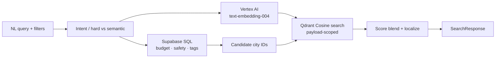

# GenAI Travel Compass

Personalized travel recommendations with **deterministic SQL filters** and **hybrid RAG** (Vertex AI embeddings + Qdrant), plus a **tool-calling itinerary agent**, served by FastAPI and a Next.js UI.

**Locales:** `en` · `zh-HK` (Traditional Chinese) · `ja`

[Quick Start](#quick-start) · [Architecture](#architecture) · [Features](#features--roadmap) · [Setup](#local-setup) · [API](#api) · [Docs](#documentation)

---

## Quick Start

```bash
# 1. Env + deps
cp .env.example .env          # fill SUPABASE_*, QDRANT_*, GCP_*, etc.
pip install -r requirements.txt
npm install

# 2. Data (once)
# Apply schema.sql in Supabase, then:
python scripts/seed_db.py
python scripts/embed_destinations.py
python scripts/ensure_qdrant_indexes.py

# 3. Run API + web (two terminals)
python -m uvicorn src.main:app --reload --port 8000
npm run dev
```

- Explore: http://localhost:3000/explore  
- Planner: http://localhost:3000/planner  
- API docs: http://localhost:8000/docs  

**Live demo:** [travel.jackymadream.com](https://travel.jackymadream.com) · **API:** [api.jackymadream.com](https://api.jackymadream.com)

**Docker:** `docker compose up --build` — full steps in [`docs/DEPLOYMENT.md`](./docs/DEPLOYMENT.md).

**Smoke test** (API must be up):

```bash
python scripts/smoke_test.py --allow-degraded
```

---

## Architecture

Hard constraints (budget, safety, tags) run in **PostgreSQL first**. Soft preference matching runs in **Qdrant**, scoped only to that candidate set — see [`CONTEXT.md`](./CONTEXT.md) and [`docs/RAG_ARCHITECTURE.md`](./docs/RAG_ARCHITECTURE.md).



| Layer | Stack |
|-------|--------|
| Frontend | Next.js 15 (App Router), TypeScript, Tailwind CSS, shadcn-style UI |
| API | FastAPI, Pydantic v2, Pytest (TDD) |
| Data | Supabase PostgreSQL (JSONB i18n, `cities` / `countries`) |
| Vectors | Qdrant Cloud · 768-d Cosine · `travel_destinations` |
| Embeddings | Google Cloud Vertex AI `text-embedding-004` |
| Cache | Redis (optional) with in-memory TTL fallback |

---

## Features & roadmap

### Phase 1 — Foundation
- [x] PostgreSQL schema with multilingual JSONB (`en` / `zh-HK` / `ja`)
- [x] Seed script + destination embeddings into Qdrant
- [x] `GET /api/v1/countries` with locale, budget, safety filters (TDD)
- [x] Explore page: sidebar filters + country card grid

### Phase 2 — Hybrid RAG search
- [x] Search schemas + RAG architecture docs
- [x] `RagService` (query embed + payload-scoped Qdrant search)
- [x] `SearchService` (SQL candidates → vector rank → `SearchResponse`)
- [x] `POST /api/v1/search` (TDD)
- [x] Explore AI search bar, match scores, empty-reason UX
- [x] Qdrant payload indexes for `city_id` filtering

### Phase 3 — Agentic itinerary
- [x] Agent architecture doc + itinerary schemas + `AgentService` stub
- [x] Agent tools: POI search + schedule/budget evaluator (+ unit tests)
- [x] Tool-calling agent loop + `POST /api/v1/itineraries/generate` (TDD)
- [x] Explore UI for itinerary generation (`/planner`)
- [ ] Live LLM provider wiring (optional seam already in `AgentService`)

### Phase 4 — Caching, observability & deployment (complete)
- [x] Redis / in-memory `CacheService` for embeddings (24h) and POI results (7d)
- [x] JSON structured logging + `X-Request-ID` middleware
- [x] Dockerfiles + compose + `/health` / `/health/liveness` probes
- [x] E2E smoke test (`scripts/smoke_test.py`) + [`docs/DEPLOYMENT.md`](./docs/DEPLOYMENT.md)

---

## Local setup

### Prerequisites

- Python 3.11+
- Node.js 18+
- Accounts / keys: Supabase, Qdrant Cloud, GCP (Vertex AI)

### 1. Clone & env

```bash
git clone https://github.com/jackymadream/AI-Travel-Compass.git
cd AI-Travel-Compass
cp .env.example .env
```

Fill `.env` (see comments in `.env.example` and the [deployment checklist](./docs/DEPLOYMENT.md#3-environment-variables-checklist)):

| Variable | Purpose |
|----------|---------|
| `SUPABASE_URL` / `SUPABASE_SERVICE_ROLE_KEY` | Postgres API |
| `GCP_PROJECT_ID` / `GOOGLE_APPLICATION_CREDENTIALS` | Vertex embeddings |
| `QDRANT_URL` / `QDRANT_API_KEY` | Vector store |
| `REDIS_URL` | Optional Redis cache (falls back to in-memory TTL) |
| `GEMINI_API_KEY` | Optional future LLM agent (heuristic planner works without it) |
| `NEXT_PUBLIC_API_URL` | Frontend → API (local `http://127.0.0.1:8000`; prod `https://api.jackymadream.com`) |
| `CORS_ORIGINS` | Allowed UI origins (prod `https://travel.jackymadream.com` + localhost) |

### 2. Database & vectors

```bash
# Apply schema.sql in the Supabase SQL editor (if not already applied)
pip install -r requirements.txt
python scripts/seed_db.py
python scripts/embed_destinations.py
python scripts/ensure_qdrant_indexes.py   # city_id / locale / country_id indexes
```

### 3. Backend

```bash
python -m pytest
python -m uvicorn src.main:app --reload --port 8000
```

- Health: http://127.0.0.1:8000/health  
- OpenAPI: http://127.0.0.1:8000/docs  

### 4. Frontend

From the **repo root** (not a `frontend/` folder):

```bash
npm install
npm run dev
```

Open http://localhost:3000/explore — keep both servers running.

### 5. Docker

See [`docs/DEPLOYMENT.md`](./docs/DEPLOYMENT.md) for full instructions.

```bash
docker compose up --build
# Optional Redis: docker compose --profile cache up --build
python scripts/smoke_test.py --allow-degraded
```

---

## API

| Method | Path | Description |
|--------|------|-------------|
| `GET` | `/api/v1/countries` | List countries (`locale`, `max_budget`, `min_safety_rating`) |
| `POST` | `/api/v1/search` | Hybrid RAG search (`query`, `locale`, `max_budget`, `min_safety`, `tags`) |
| `POST` | `/api/v1/itineraries/generate` | Tool-calling itinerary agent (`city_id`, `days`, `pace`, budget, prefs) |
| `GET` | `/health` | Readiness: Redis + Qdrant + Supabase (`ok` / `degraded`) |
| `GET` | `/health/liveness` | Container liveness (`alive`) |

Example search body:

```json
{
  "query": "Cozy food city by the sea",
  "locale": "zh-HK",
  "max_budget": 150,
  "min_safety": 4,
  "tags": ["food"],
  "limit": 5
}
```

---

## Project layout

```
├── app/                    # Next.js App Router (Explore + Planner)
├── components/             # UI + explore / planner
├── src/
│   ├── main.py             # FastAPI entry + request ID middleware
│   ├── routers/            # countries, search, itinerary, health
│   ├── schemas/            # Pydantic contracts
│   ├── services/           # Search, RAG, agent, cache, health
│   └── utils/              # JSON structured logging
├── scripts/                # seed, embed, indexes, smoke_test
├── tests/                  # Pytest
├── docs/                   # RAG, agent, deployment
├── Dockerfile.backend
├── Dockerfile.frontend
├── docker-compose.yml
├── schema.sql
└── CONTEXT.md
```

---

## Documentation

| Doc | Contents |
|-----|----------|
| [`docs/DEPLOYMENT.md`](./docs/DEPLOYMENT.md) | Docker, Cloud Run, Vercel, env checklist |
| [`CONTEXT.md`](./CONTEXT.md) | Domain glossary, hard vs soft constraints, SQL/LLM boundary |
| [`docs/RAG_ARCHITECTURE.md`](./docs/RAG_ARCHITECTURE.md) | Hybrid search pipeline |
| [`docs/AGENT_ARCHITECTURE.md`](./docs/AGENT_ARCHITECTURE.md) | Tool-calling itinerary agent |
| [`AGENTS.md`](./AGENTS.md) | Agent skill pointers (issues, triage, domain) |
| [`schema.sql`](./schema.sql) | Tables, indexes, i18n checks |

---

## Contact

**Jacky Ma (MA KA YAU)**  
Email: [jackyma.dream@gmail.com](mailto:jackyma.dream@gmail.com)  
LinkedIn: [linkedin.com/in/jacky-ma-546062370](https://www.linkedin.com/in/jacky-ma-546062370/)

---

MIT-style use unless otherwise noted. Active development.
