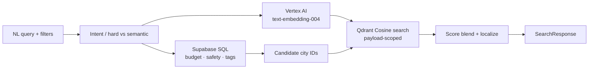

# GenAI Travel Compass

Personalized travel recommendations with **deterministic SQL filters** and **hybrid RAG** (Vertex AI embeddings + Qdrant), served by FastAPI and a Next.js Explore UI.

**Locales:** `en` · `zh-HK` (Traditional Chinese) · `ja`

[Architecture](#architecture) · [Features](#features--roadmap) · [Setup](#local-setup) · [API](#api) · [Docs](#documentation)

---

## Architecture

Hard constraints (budget, safety, tags) run in **PostgreSQL first**. Soft preference matching runs in **Qdrant**, scoped only to that candidate set — see [`CONTEXT.md`](./CONTEXT.md) and [`docs/RAG_ARCHITECTURE.md`](./docs/RAG_ARCHITECTURE.md).



| Layer | Stack |
|-------|--------|
| Frontend | Next.js 15 (App Router), TypeScript, Tailwind CSS, shadcn-style UI |
| API | FastAPI, Pydantic v2, Pytest (TDD) |
| Data | Supabase PostgreSQL (JSONB i18n, `cities` / `countries`) |
| Vectors | Qdrant Cloud · 768-d Cosine · `travel_destinations` |
| Embeddings | Google Cloud Vertex AI `text-embedding-004` |

---

## Features & roadmap

### Phase 1 — Foundation
- [x] PostgreSQL schema with multilingual JSONB (`en` / `zh-HK` / `ja`)
- [x] Seed script + destination embeddings into Qdrant
- [x] `GET /api/v1/countries` with locale, budget, safety filters (TDD)
- [x] Explore page: sidebar filters + country card grid

### Phase 2 — Hybrid RAG search
- [x] Search schemas + RAG architecture docs
- [x] `RagService` (query embed + payload-scoped Qdrant search)
- [x] `SearchService` (SQL candidates → vector rank → `SearchResponse`)
- [x] `POST /api/v1/search` (TDD)
- [x] Explore AI search bar, match scores, empty-reason UX
- [x] Qdrant payload indexes for `city_id` filtering

### Phase 3 — Agentic itinerary (planned)
- [ ] LangGraph multi-step planner over the frozen candidate set
- [ ] Day-by-day itinerary + hard-rule validation node

---

## Local setup

### Prerequisites

- Python 3.11+
- Node.js 18+
- Accounts / keys: Supabase, Qdrant Cloud, GCP (Vertex AI)

### 1. Clone & env

```bash
git clone https://github.com/jackymadream/AI-Travel-Compass.git
cd AI-Travel-Compass
cp .env.example .env
```

Fill `.env` (see comments in `.env.example`):

| Variable | Purpose |
|----------|---------|
| `SUPABASE_URL` / `SUPABASE_SERVICE_ROLE_KEY` | Postgres API |
| `GCP_PROJECT_ID` / `GOOGLE_APPLICATION_CREDENTIALS` | Vertex embeddings |
| `QDRANT_URL` / `QDRANT_API_KEY` | Vector store |
| `NEXT_PUBLIC_API_URL` | Frontend → API (default `http://127.0.0.1:8000`) |
| `CORS_ORIGINS` | e.g. `http://localhost:3000` |

### 2. Database & vectors

```bash
# Apply schema.sql in the Supabase SQL editor (if not already applied)
pip install -r requirements.txt
python scripts/seed_db.py
python scripts/embed_destinations.py
python scripts/ensure_qdrant_indexes.py   # city_id / locale / country_id indexes
```

### 3. Backend

```bash
python -m pytest
python -m uvicorn src.main:app --reload --port 8000
```

- Health: http://127.0.0.1:8000/health  
- OpenAPI: http://127.0.0.1:8000/docs  

### 4. Frontend

From the **repo root** (not a `frontend/` folder):

```bash
npm install
npm run dev
```

Open http://localhost:3000/explore — keep both servers running.

---

## API

| Method | Path | Description |
|--------|------|-------------|
| `GET` | `/api/v1/countries` | List countries (`locale`, `max_budget`, `min_safety_rating`) |
| `POST` | `/api/v1/search` | Hybrid RAG search (`query`, `locale`, `max_budget`, `min_safety`, `tags`) |
| `GET` | `/health` | Liveness |

Example search body:

```json
{
  "query": "Cozy food city by the sea",
  "locale": "zh-HK",
  "max_budget": 150,
  "min_safety": 4,
  "tags": ["food"],
  "limit": 5
}
```

---

## Project layout

```
├── app/                    # Next.js App Router (Explore UI)
├── components/             # UI + explore filters / AI search
├── src/
│   ├── main.py             # FastAPI entry
│   ├── routers/            # countries, search
│   ├── schemas/            # Pydantic contracts
│   └── services/           # SearchService, RagService
├── scripts/                # seed_db, embed_destinations, Qdrant indexes
├── tests/                  # Pytest (countries, search, service)
├── docs/                   # RAG architecture + agent domain notes
├── schema.sql              # PostgreSQL DDL
└── CONTEXT.md              # Domain model & hard/soft rules
```

---

## Documentation

| Doc | Contents |
|-----|----------|
| [`CONTEXT.md`](./CONTEXT.md) | Domain glossary, hard vs soft constraints, SQL/LLM boundary |
| [`docs/RAG_ARCHITECTURE.md`](./docs/RAG_ARCHITECTURE.md) | Hybrid search pipeline |
| [`AGENTS.md`](./AGENTS.md) | Agent skill pointers (issues, triage, domain) |
| [`schema.sql`](./schema.sql) | Tables, indexes, i18n checks |

---

## Contact

**Jacky Ma (MA KA YAU)**  
Email: [jackyma.dream@gmail.com](mailto:jackyma.dream@gmail.com)  
LinkedIn: [linkedin.com/in/jacky-ma-546062370](https://www.linkedin.com/in/jacky-ma-546062370/)

---

MIT-style use for portfolio / interview demos unless otherwise noted. Active development.
